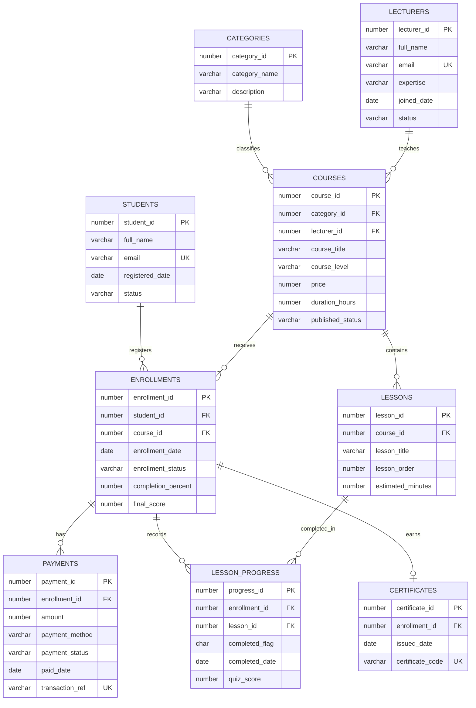

# CourseConnect ER Diagram

## Design Explanation

The Oracle database stores structured, transactional data. It uses primary keys, foreign keys, unique constraints, check constraints, and indexes to protect data quality. Students can enroll in many courses, and each course can have many students, so the relationship is resolved through `enrollments`.

Course progress is tracked per lesson in `lesson_progress`. This allows the system to calculate completion percentage and final score. Payments are linked to enrollments so revenue can be reported by course, period, and lecturer.

MongoDB complements this model by storing flexible content that changes shape often:

- `courseResources` for notes, videos, quizzes, and extra materials
- `courseReviews` for ratings and open-ended feedback
- `discussionThreads` for forum questions and answers
